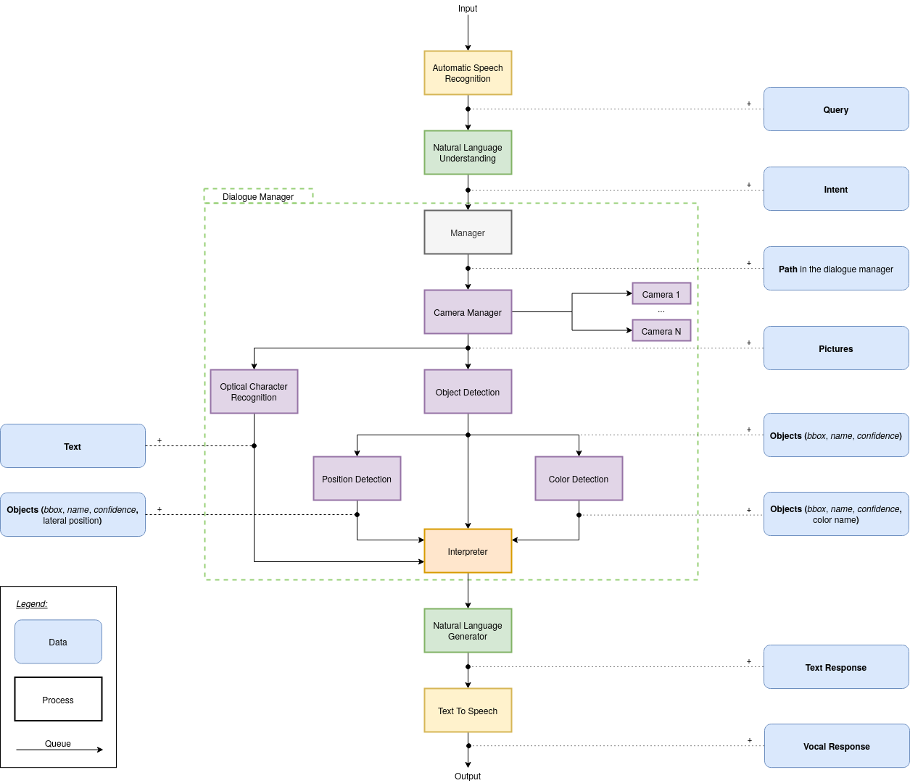

# Ayesaac

This repository contains the source code for Ayesaac, a Python program to help blind people to find what they have lost in a room.

## Getting started

1. Pull the repo
1. Pull the files in git-lfs using `git-lfs pull`. (you may need `git lfs install` first).

It's recommended that you use [Docker](https://docker.com) for development to avoid fighting with dependencies, but you can always follow [these instructions](https://github.com/Aye-saac/aye-saac/wiki/Installing-things) if you want to have things running manually.

### Developing with Docker

Using `make build_image`, you can build an image which will be used for all services required by the system. Then, you can run it using `docker-compose up` and all related services will load up.

When creating the image, [models are downloaded](https://github.com/Aye-saac/aye-saac/blob/1163ff751be4800925af5ee39e1d84f858be9ea5/Dockerfile#L47) and [placed in the right place](https://github.com/Aye-saac/aye-saac/blob/1163ff751be4800925af5ee39e1d84f858be9ea5/Dockerfile#L69) to make life easier.

Note: Because they all need RabbitMQ to work, they will error and restart a bunch of times and then stabilise once RabbitMQ is ready and work properly.

### Architecture

## Publications

* Elisa Ramil Brick, Vanesa Caballero Alonso, Conor O'Brien, Sheron Tong, Emilie Tavernier, Amit Parekh, Angus Addlesee, and Oliver Lemon, "Am I Allergic to This? Assisting Sight Impaired People in the Kitchen",  **ICMI 2021**. (to appear)
* Katie Baker, Amit Parekh, Adrien Fabre, Angus Addlesee, Ruben Kruiper, and Oliver Lemon, "The Spoon is in the Sink: Assisting Visually Impaired People in the Kitchen", **ReInAct 2021**. (to appear)

### Acknowledgements

We couldn't have done this work without Vincent Larcher, Lucas Dumy, Alexandre Cardaillac, Katerina Alexander, Hamish MacKinnon, Theo Ferreira, Shubham Agarwal Julian Frabel, Noe Rivals, Guillaume Jeanne, Rachel Yu, Basile Lamarque, and Nejma Belkhanfar.
