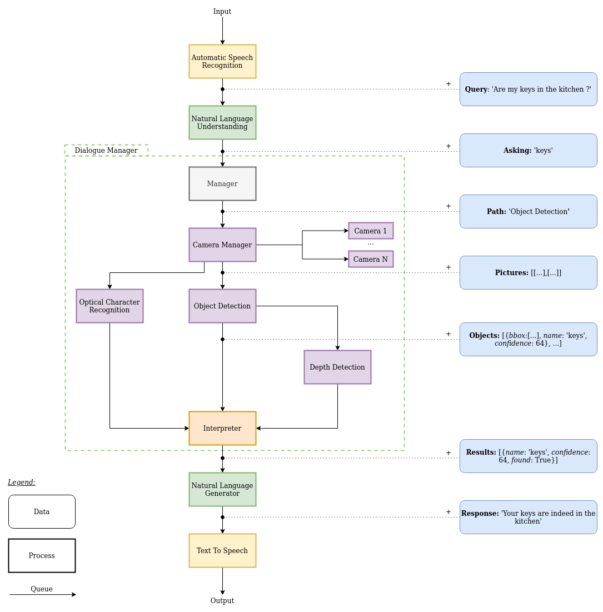

# Ayesaac

This repository contains the source code for Ayesaac, a Python program to help blind people to find what they have lost in a room.  

## Alternative setting up without poetry 

### Dependencies

- Python 3.7

- pip >= 20.0.2

```
pip3 install --upgrade pip
```

- This program uses [RabbitMQ](https://www.rabbitmq.com/) to communicates 
between the different processors of the software.
Therefore, installing RabbitMQ is a pre-requisite.
You can find instructions [here](https://www.rabbitmq.com/download.html).

### Installation

Once the dependencies have been taken care of, you need to install different packages.

#### `pip` installation

Run the following commands after installing RabbitMQ:

- [TensorFlow](https://www.tensorflow.org/)

`TensorFlow for CPU only`
```
pip3 install --upgrade tensorflow==2.1.0
```
`TensorFlow for GPU`
```
pip3 install --upgrade tensorflow-gpu==2.1.0
```

- Opencv

```
pip3 install --upgrade opencv-python
```

- Pika

```
pip3 install --upgrade pika
```

### Usage

First, start with:
```
./start_all_services.sh
```
After a few seconds, all the services will run in the background, waiting to do work, some warnings can appear, don't worry, it's just Tensorflow 
saying it doesn't find any compatible GPU or that CUDA is not installed, just ignore it, running Tensorflow 
with the GPU is not mandatory.

Now, we just need to tell the first service that there is job to be done ! 
`send_one_request.py` will ping the first service and the rest will follow (send_one_request.py will be replace in the future):
```
python3 send_one_request.py
```

You can look at the `logs/` directory for the services outputs.

To stop the services you just need to enter the following:
```
./stop_all_services.sh
```

### Architecture


